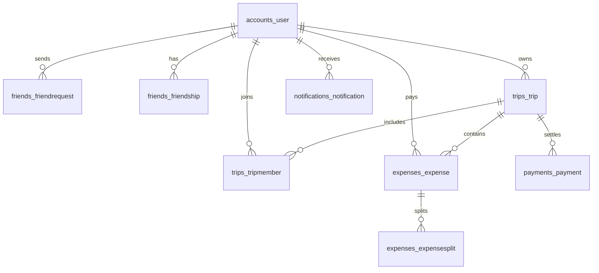

# SplitSync Pro

SplitSync Pro is a full-stack group trip expense splitter with Django REST Framework, PostgreSQL, JWT authentication, Cloudinary URL storage, and a React 19 + Vite + TypeScript + Tailwind frontend.

## Features
- JWT register, login, logout, profile update, password change, account deletion.
- Friends, friend requests, trip membership, ownership transfer, archiving, and invitations.
- Decimal-only expense splitting: equal, exact, percentage, share units, and custom amounts.
- Debt simplification engine for minimized settlements.
- Payments, partial/full settlement history, notifications, reporting, charts, and CSV export.
- Public landing page with hero, features, timeline, live demo, testimonials, FAQ, and footer.
- PostgreSQL-ready models with UUID primary keys, indexes, constraints, and audit logging.

## Installation Guide

### Backend
```bash
cd backend
python -m venv .venv
source .venv/bin/activate
pip install -r requirements.txt
cp .env.example .env
python manage.py makemigrations
python manage.py migrate
python manage.py createsuperuser
python manage.py runserver
```

### Frontend
```bash
cd frontend
npm install
npm run dev
```

## Environment Variables
See `backend/.env.example` for PostgreSQL, CORS, JWT/Django secret, and Cloudinary settings. The frontend uses `VITE_API_URL`, defaulting to `http://localhost:8000/api`.

## API Documentation
Base URL: `/api/`

| Area | Endpoints |
| --- | --- |
| Auth | `auth/register/`, `auth/login/`, `auth/refresh/`, `auth/logout/`, `auth/profile/`, `auth/change-password/` |
| Friends | `friends/users/`, `friends/requests/`, `friends/requests/{id}/accept/`, `friends/requests/{id}/reject/`, `friends/{id}/remove/` |
| Trips | `trips/`, `trips/{id}/archive/`, `trips/{id}/invite/`, `trips/{id}/transfer_ownership/` |
| Expenses | `expenses/`, `expenses/balances/?trip=<uuid>` |
| Payments | `payments/` |
| Reports | `reports/`, `reports/export/csv/` |
| Notifications | `notifications/`, `notifications/{id}/mark_read/` |

All protected endpoints require `Authorization: Bearer <access_token>`.

## PostgreSQL Schema
Core tables: `accounts_user`, `friends_friendrequest`, `friends_friendship`, `trips_trip`, `trips_tripmember`, `expenses_expense`, `expenses_expensesplit`, `payments_payment`, `notifications_notification`, and `common_auditlog`.

## ER Diagram


## Cloudinary Setup Guide
Create a Cloudinary account, copy cloud name, API key, and API secret into `.env`, upload images from the client or a trusted backend endpoint, and store only returned HTTPS secure URLs in `profile_picture_url`, `trip_image_url`, and `receipt_image_url`.
